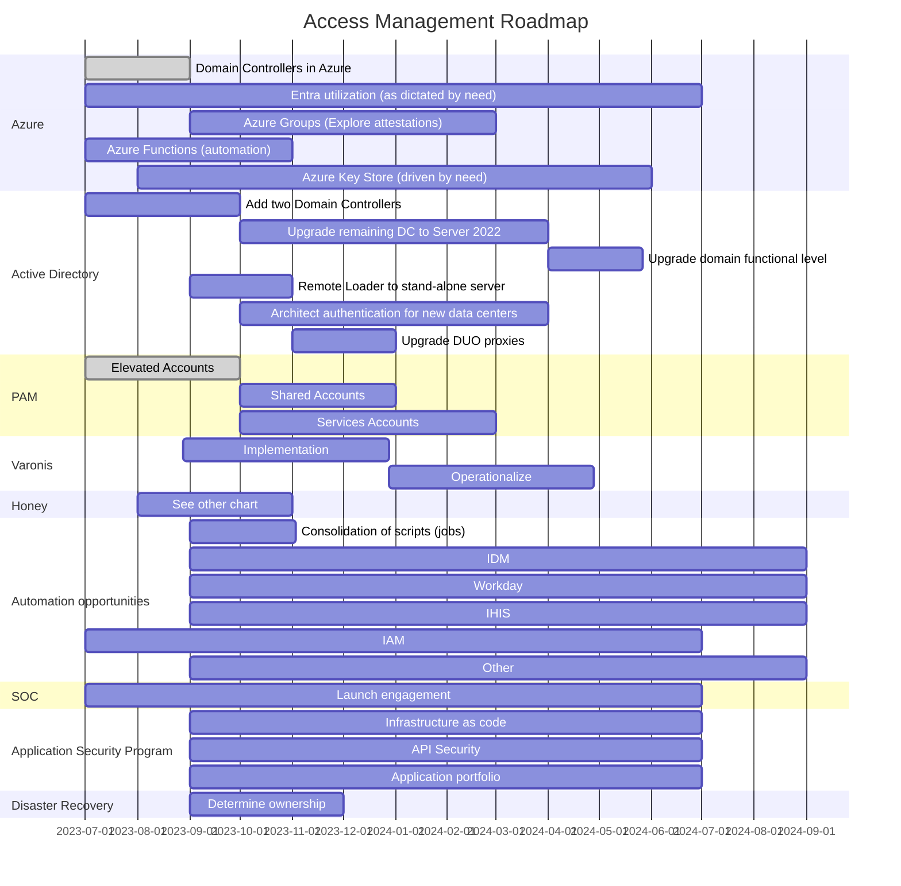

```mermaid

gantt
    title Access Management Roadmap
    dateFormat  YY-MM-DD
    todayMarker on

    %% excludes    Weekends
    
section Azure
Domain Controllers in Azure             :done,2023-07-01, 2M
Entra utilization (as dictated by need) :2023-07-01, 12M
Azure Groups (Explore attestations)     :2023-09-01, 6M
Azure Functions (automation)            :2023-07-01, 4M
Azure Key Store (driven by need)        :2023-08-01, 10M

section Active Directory                    
Add two Domain Controllers              :a1,2023-07-01, 3M
Upgrade remaining DC to Server 2022     :a2,after a1, 6M
Upgrade domain functional level         :a3,after a2, 8w
Remote Loader to stand-alone server     :2023-09-01,2M
Architect authentication for new data centers: 2023-10-01, 6M
Upgrade DUO proxies                     :2023-11-01, 2M

section PAM
Elevated Accounts                       :done,p1, 2023-07-01, 3M
Shared Accounts                         :after p1,3M
Services Accounts                       :after p1,5M

section Varonis
Implementation                          :v1, 2023-08-28, 4M
Operationalize                          :after v1, 4M

section Honey 
See other chart                         :2023-08-01, 3M

section Automation opportunities
Consolidation of scripts (jobs)         :2023-09-01, 9w
IDM                                     :2023-09-01, 12M
Workday                                 :2023-09-01, 12M
IHIS                                    :2023-09-01, 12M
IAM                                     :2023-07-01, 12M
Other                                   :2023-09-01, 12M

section SOC
Launch engagement                       :2023-07-01, 12M

section Application Security Program   
Infrastructure as code                  :2023-09-01, 10M
API Security                            :2023-09-01, 10M
Application portfolio                   :2023-09-01, 10M

section Disaster Recovery
Determine ownership                     :2023-09-01, 3M

```