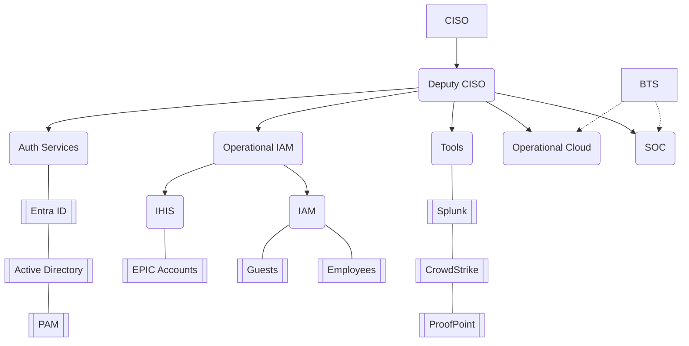

```mermaid
flowchart TD
    
    
    A[CISO] -->DS(Deputy CISO)
    
    DS          --> AD(Auth Services)
    AD          --- Entra[[Entra ID]]
    Entra       --- Active[[Active Directory]]
    Active      --- PAM[[PAM]]

    DS          --> IAM(Operational IAM)
    IAM         --> oIAM(IAM)
    IAM         --> IHIS(IHIS)

    IHIS        --- EPIC[[EPIC Accounts]]       
    oIAM        --- Guests[[Guests]]
    oIAM        --- Employees[[Employees]]
    
    DS          --> Tools(Tools)
    Tools       --- Splunk[[Splunk]]
    Splunk      --- CrowdStrike[[CrowdStrike]]
    CrowdStrike --- ProofPoint[[ProofPoint]]
    
    DS          --> Cloud(Operational Cloud)
    
    DS --> SOC(SOC)
    BTS -.-> SOC
    BTS -.-> Cloud

    
    
    
```