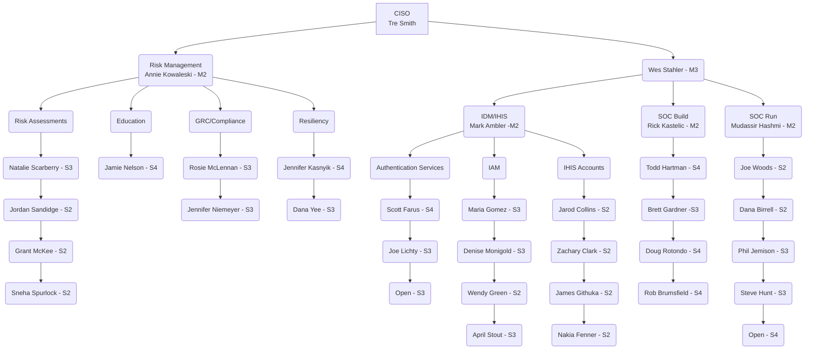

```mermaid

flowchart TD
    %% Tre and direct reports
    A[CISO<br>Tre Smith]    -->     R(Risk Management<br>Annie Kowaleski - M2)
    A                       -->     DS(Wes Stahler - M3)
    

    %%  Risk Management Team - Annie
    R                       -->     Risk(Risk Assessments)
    Risk                    -->     NS(Natalie Scarberry - S3)
    NS                      -->     JS(Jordan Sandidge - S2)
    JS                      -->     GM(Grant McKee - S2)
    GM                      -->     SS(Sneha Spurlock - S2)

    R                       -->     ED(Education)
    ED                      -->     J(Jamie Nelson - S4)
    
    R                       -->     GRC(GRC/Compliance)
    GRC                     -->     RM(Rosie McLennan - S3)
    RM                      -->     JN(Jennifer Niemeyer - S3)

    R                       -->     Res(Resiliency)
    Res                     -->     JK(Jennifer Kasnyik - S4)
    JK                      -->     SL(Dana Yee - S3)
    %%%%%%%%%%%%%%%%%%%%%%%%%%%%%%%%%%%%%%%%%%%%%%%%%%%%%%%%%%%%%
    
    %% Identity, Etc.    
    DS                      -->     IAM(IDM/IHIS<br> Mark Ambler -M2)
    IAM                     -->     AS(Authentication Services)
    AS                      -->     SF(Scott Farus - S4)
    SF                      -->     JL(Joe Lichty - S3)
    JL                      -->     Open(Open - S3)
    
    IAM                     -->     oIAM(IAM)
    oIAM                    -->     MG(Maria Gomez - S3)
    MG                      -->     DM(Denise Monigold - S3)
    DM                      -->     WG(Wendy Green - S2)
    WG                      -->     Stout(April Stout - S3)
    
    IAM                     -->     IHIS(IHIS Accounts)
    IHIS                    -->     JC(Jarod Collins - S2)
    JC                      -->     ZC(Zachary Clark - S2)
    ZC                      -->     JG(James Githuka - S2)
    JG                      -->     NF(Nakia Fenner - S2)
    %%%%%%%%%%%%%%%%%%%%%%%%%%%%%%%%%%%%%%%%%%%%%%%%%%%%%%%%%%%%%
    
    %% Security Architecture 
    DS                      -->     AR(SOC Build<br>Rick Kastelic - M2) 
    AR                      -->     TH(Todd Hartman - S4)
    TH                      -->     BG(Brett Gardner -S3)   
    BG                      -->     DR(Doug Rotondo - S4)
    DR                      -->     RB(Rob Brumsfield - S4)
    %%%%%%%%%%%%%%%%%%%%%%%%%%%%%%%%%%%%%%%%%%%%%%%%%%%%%%%%%%%%%

    %% SOC and Tooling
    DS                      -->     SOC(SOC Run<br>Mudassir Hashmi - M2)
    SOC                     -->     JW(Joe Woods - S2)
    JW                      -->     DB(Dana Birrell - S2)
    DB                      -->     PJ(Phil Jemison - S3)
    PJ                      -->     SH(Steve Hunt - S3)
    SH                      -->     GD(Open - S4)
    %%%%%%%%%%%%%%%%%%%%%%%%%%%%%%%%%%%%%%%%%%%%%%%%%%%%%%%%%%%%%

    
    
    
```