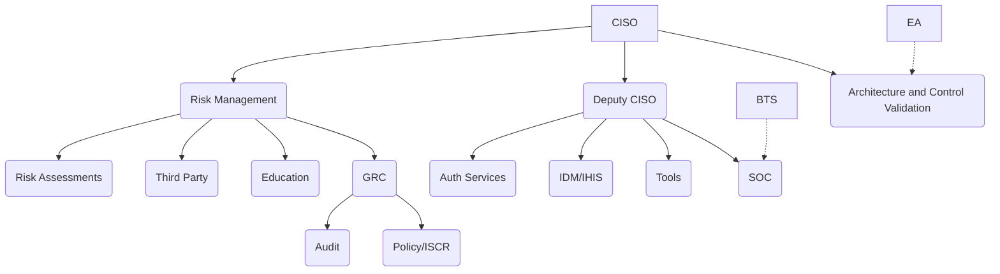

```mermaid
flowchart TD
    A[CISO] -->R(Risk Management)
    
    
    R --> Risk(Risk Assessments)
    R --> Third(Third Party)
    R --> ED(Education)
    R --> GRC(GRC)
    GRC --> Audit(Audit)
    GRC --> P(Policy/ISCR)
    

    A[CISO] -->DS(Deputy CISO)
    
    DS --> AD(Auth Services)
    DS --> IDM(IDM/IHIS)
    
    DS --> Tools(Tools)
    DS --> SOC(SOC)
    BTS -.-> SOC

    A[CISO] -->AR(Architecture and Control Validation )
    EA[EA] -.-> AR
    
    
    
```