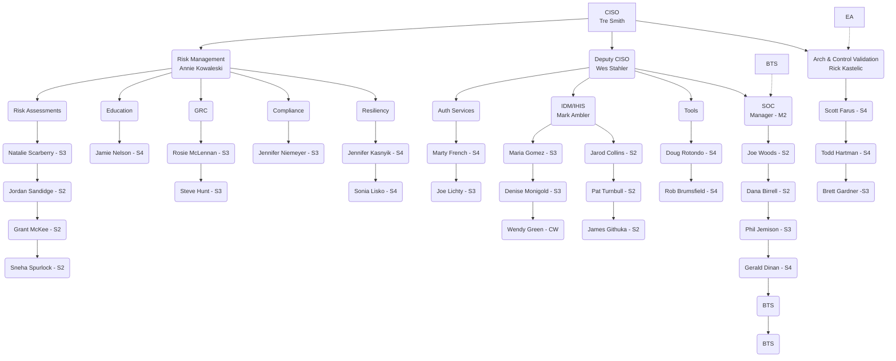

```mermaid
flowchart TD
    A[CISO<br>Tre Smith] -->R(Risk Management<br>Annie Kowaleski)
    A -->DS(Deputy CISO<br>Wes Stahler)
    A -->AR(Arch & Control Validation<br>Rick Kastelic)

    %%  Risk Management Team
    R --> Risk(Risk Assessments)
    Risk --> NS(Natalie Scarberry - S3)
    NS --> JS(Jordan Sandidge - S2)
    JS --> GM(Grant McKee - S2)
    GM --> SS(Sneha Spurlock - S2)

    R --> ED(Education)
    ED --> J(Jamie Nelson - S4)
    
    R --> GRC(GRC)
    GRC --> RM(Rosie McLennan - S3)
    RM --> SH(Steve Hunt - S3)

    R --> C(Compliance)
    C --> JN(Jennifer Niemeyer - S3)

    R--> Res(Resiliency)
    Res --> JK(Jennifer Kasnyik - S4)
    JK --> SL(Sonia Lisko - S4)

    
    %% Identity, Etc.    
    DS --> AD(Auth Services)
    AD --> MF(Marty French - S4)
    MF --> JL(Joe Lichty - S3)
    
     DS --> IAM(IDM/IHIS<br> Mark Ambler)
    IAM -->MG(Maria Gomez - S3)
    MG -->DM(Denise Monigold - S3)
    DM -->WG(Wendy Green - CW)
    IAM -->JC(Jarod Collins - S2)
    JC -->PT(Pat Turnbull - S2)
    PT -->JG(James Githuka - S2)
    
    DS --> Tools(Tools)
    Tools --> DR(Doug Rotondo - S4)
    DR --> RB(Rob Brumsfield - S4)
    DS --> SOC(SOC<br>Manager - M2)
    
    SOC--> JW(Joe Woods - S2)
    JW --> DB(Dana Birrell - S2)
    DB --> PJ(Phil Jemison - S3)
    PJ --> GD(Gerald Dinan - S4)
    GD -->O1(BTS)
    O1 -->O2(BTS)
    BTS -.-> SOC

    %% Security Architecture 
    EA[EA] -.-> AR
    AR --> SF(Scott Farus - S4)
    SF --> TH(Todd Hartman - S4)
    TH --> BG(Brett Gardner -S3)   
    
```