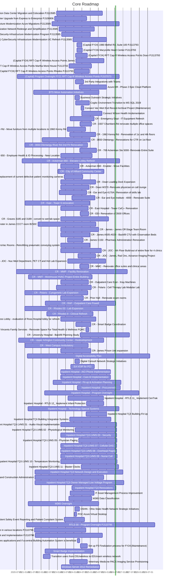

```mermaid
%%{init:
    {
        "gantt":{
            "titleTopMargin":25,
            "leftPadding":80,
            "numberSectionStyles":2,
            %%"topAxis":"true",
            "axisFormat":"%b-%Y",
            "barHeight":30,
            "barGap":15,
            "useMaxWidth": true
        }
    }
}%%

gantt
    title Core Roadmap
    todayMarker stroke-width:5px,stroke:green,opacity:0.5
    tickInterval 6month
    
(Capital CyberSecurity-Infrastructure Modernization Data Center Migration and Colocation PJ113585:	 12/12/2022,	 146w
(Capital FY21 - TH) Call Center Upgrade from Express to Enterprise PJ108806:	 11/1/2022,	 102w
(Capital FY23) CyberSecurity-Infrastructure Modernization Azure Migrations PJ113585:	 9/1/2022,	 214w
(Capital FY23) CyberSecurity-Infrastructure Modernization Network Redesign and Simplification PJ113585:	 2/2/2023,	 113w
(Capital FY23) CyberSecurity-Infrastructure Modernization Program PJ113585:	 4/3/2023,	 92w
(Capital FY23) CyberSecurity-Infrastructure Modernization UC Refresh PJ113585:	 12/11/2023,	 107w
(Capital FY24) 1980 Bethel Rd, Suite 100 PJ113793:	 3/11/2024,	 16w
(Capital FY24) Marysville Heart Center PJ113793:	 3/11/2024,	 17w
(Capital FY24) RFT Cap-R Wireless Access Points Doan PJ113793:	 2/8/2024,	 38w
(Capital FY24) RFT Cap-R Wireless Access Points James:	 2/12/2024,	 90w
(Capital FY24) RFT Cap-R Wireless Access Points Martha More House PJ113793:	 9/18/2023,	 71w
(Capital FY24) RFT Cap-R Wireless Access Points Rhodes PJ113793:	 1/17/2024,	 47w
(Capital) Program Oversight FY21 RFT Cap-R Wireless Access Points  PJ107073:	 7/20/2020,	 325w
3rd Party Integrations with Teams:	 2/5/2024,	 26w
Azure DR - Phase 2 Epic Cloud Platform:	 4/30/2024,	 87w
BTS Minor Automation Initiatives:	 7/20/2021,	 208w
Business Outreach Strategic Initiatives:	 1/24/2024,	 15w
Cogito Environment Transition to MS SQL 2019:	 2/9/2024,	 44w
Connect Van Wert Exit Record Archival Project (Maintenance):	 6/12/2024,	 9w
Connect Wilson Health Implementation:	 6/24/2024,	 65w
CR -  Emergency Dept - IT Equipment Refresh:	 10/9/2023,	 77w
CR - 1507 Chambers Rd renovate multiple office spaces:	 5/15/2024,	 37w
CR - 1960 Kenny Rd - Move furniture from multiple locations to 1960 Kenny Rd:	 8/10/2023,	 58w
CR - 1960 Kenny Rd - Renovation of 1st and 4th floors:	 9/29/2023,	 83w
CR - 3650 Olentangy - Renovations for CTR on 1st floor:	 1/25/2022,	 153w
CR - 3650 Olentangy River Rd 2nd Flr Renovation:	 1/1/2021,	 200w
CR - 700 Ackerman Ste 5000- Renovate Entire Suite:	 5/14/2024,	 53w
CR - Ackerman 650 - Employee Health & ID Processing - New Location:	 3/17/2023,	 100w
CR - Ackerman 660 - Elevator Lobby Refresh:	 11/2/2020,	 311w
CR - Ackerman 660 - Enabler - Move Facilities:	 3/17/2023,	 58w
CR - City of Hilliard Community Center:	 1/9/2023,	 147w
CR - Doan 236 - Replacement of current defective patient monitoring cameras:	 6/3/2023,	 59w
CR - Doan Loading Dock Expansion:	 3/17/2023,	 111w
CR - Doan W370 -Renovate physician on call lounge:	 3/17/2023,	 90w
CR - Ear and Eye 4170A - Renovation of skills lab:	 2/8/2023,	 88w
CR - Ear and Eye Institute - 4000 - Renovate Suite:	 11/17/2023,	 74w
CR - East - Tower 6 renovation:	 1/4/2021,	 207w
CR - East Hospital - Tower Café Renovation:	 3/17/2023,	 87w
CR - EEI- Renovation of 3500 Offices:	 5/23/2024,	 27w
CR - Graves 3185 and 3189 - convert to wet lab space:	 3/17/2023,	 152w
CR - Install an Ethos Linear Accelerater in James CCCT room B250C:	 10/27/2021,	 184w
CR - James - James Off-Stage Team Room:	 3/17/2023,	 121w
CR - James A505-A539 - Backfill CTU with Observation Beds:	 3/17/2023,	 93w
CR - James C150 - Pharmacy Administration Renovation:	 8/15/2023,	 50w
CR - James TransVac Rooms - Retrofitting pneumatic conveying system:	 3/17/2023,	 93w
CR - JOC - 4th Floor Build-out of entire floor for 4 clinics:	 3/17/2023,	 129w
CR - JOC - James, Rad Onc, Advance Imaging Project:	 4/5/2024,	 56w
CR - JOC - Nuc Med Department, PET CT and Hot Lab Expansion:	 8/17/2023,	 121w
CR - MMC - Renovate office suites and clinical areas:	 5/13/2024,	 29w
CR - MMP - Facility Renovation:	 6/30/2020,	 353w
CR - MMT - Morehouse HVAC Project Entire Building:	 3/24/2021,	 203w
CR - Outpatient Care East - Xray Machines:	 3/17/2023,	 88w
CR - Polaris - Cell Therapy Lab Modular Lab:	 12/9/2022,	 111w
CR - Polaris - Cytogenetic Lab Expansion:	 1/1/2021,	 201w
CR - Prior Hall - Renovate exam rooms:	 3/17/2023,	 72w
CR - RAF - Outpatient Care Powell:	 4/4/2022,	 224w
CR - Rhodes 03 - Lab Expansion:	 1/1/2021,	 261w
CR - Rhodes 9 - Clinical Refresh:	 5/9/2022,	 147w
CR - Ross Lobby - evaluation of Ross Hospital lobby for refresh:	 3/17/2023,	 112w
CR - Smart Badge Coordination:	 2/12/2024,	 48w
CR - St Vincents Family Services - Renovate Space For Total Health & Wellness FQHC:	 9/24/2024,	 10w
CR - University Hospital - Backfill Planning Study:	 5/23/2024,	 157w
CR - Upper Arlington Community Center - Redevelopment:	 8/20/2020,	 271w
CR - West Campus Ambulatory:	 1/4/2021,	 202w
CR- James Prison Unit expansion:	 3/17/2023,	 96w
Digital Accessibility Plan:	 3/2/2021,	 390w
Digital Consult Network Strategic Initiatives:	 1/24/2024,	 15w
EA VOIP for PCI:	 10/24/2023,	 75w
Inpatient Hospital - AIO Phone Implementation:	 3/17/2023,	 158w
Inpatient Hospital - Care AI Implementation:	 3/17/2023,	 158w
Inpatient Hospital - Fit-up & Activation Planning:	 9/28/2022,	 216w
Inpatient Hospital - Procurement:	 3/19/2024,	 137w
Inpatient Hospital - Program Oversight:	 3/21/2022,	 300w
Inpatient Hospital - RTLS 11_ Implement CenTrak:	 8/24/2023,	 113w
Inpatient Hospital - RTLS 12_ Implement Infant Protection:	 10/11/2024,	 55w
Inpatient Hospital - Technology Special Systems:	 3/15/2021,	 290w
Inpatient Hospital ΓÇô Building Fit Up:	 10/1/2024,	 65w
Inpatient Hospital ΓÇô Building Integration Systems:	 10/2/2023,	 131w
Inpatient Hospital ΓÇô LVMS 01 - Audio-Visual implementation:	 3/17/2023,	 178w
Inpatient Hospital ΓÇô LVMS 02 - Physiological Monitoring:	 2/1/2024,	 132w
Inpatient Hospital ΓÇô LVMS 03 - Security:	 3/17/2023,	 178w
Inpatient Hospital ΓÇô LVMS 05 - Physician Paging:	 4/17/2024,	 122w
Inpatient Hospital ΓÇô LVMS 07 - Cellular DAS:	 3/17/2023,	 178w
Inpatient Hospital ΓÇô LVMS 08 - Overhead Paging:	 3/17/2023,	 178w
Inpatient Hospital ΓÇô LVMS 09 - Nurse Call:	 3/17/2023,	 179w
Inpatient Hospital ΓÇô LVMS 10 - Temperature Monitoring:	 3/17/2023,	 179w
Inpatient Hospital ΓÇô LVMS 11 - Master Clocks:	 6/14/2024,	 119w
Inpatient Hospital ΓÇô Network Design and Execution:	 8/19/2021,	 280w
Inpatient Hospital ΓÇô Ongoing Design and Construction Administration:	 8/19/2021,	 219w
Inpatient Hospital ΓÇô Owner Managed Low Voltage Program:	 8/16/2021,	 283w
Inpatient Hospital ΓÇô Renovations:	 11/17/2023,	 141w
IT Asset Management Process Improvement:	 10/9/2023,	 77w
M365 Data Classification:	 9/11/2023,	 73w
M365 Oversight:	 3/22/2021,	 224w
OSHN - Ohio State Health Network Strategic Initiatives:	 1/24/2024,	 15w
POC Azure Virtual Desktop:	 1/10/2024,	 8w
RFP Replacement Patient Safety Event Reporting and Patient Complaint System:	 6/1/2023,	 65w
RTLS 00 - Program Oversight PJ110796:	 2/8/2021,	 409w
RTLS 02 - FY22 Phase 1b, 2 Install RTLS Infrastructure in various locations PJ110796:	 8/9/2021,	 163w
RTLS 03 - Use Case Development and Implementation PJ110796:	 8/24/2021,	 214w
Scoping EA Review current Facilities applications and if a central Building Automation System is beneficial:	 3/18/2024,	 8w
Set up P3 Finalization process for FY24 (Maintenance):	 5/28/2024,	 22w
Smart Badge Implementation:	 4/1/2022,	 152w
Transition users from OSUwireless to EDUroam wireless network:	 2/21/2022,	 22w
Veterinary Medicine PACS Imaging Service Provisioning:	 10/2/2023,	 56w
Windows Server 2012 Remediation:	 3/29/2023,	 122w


```