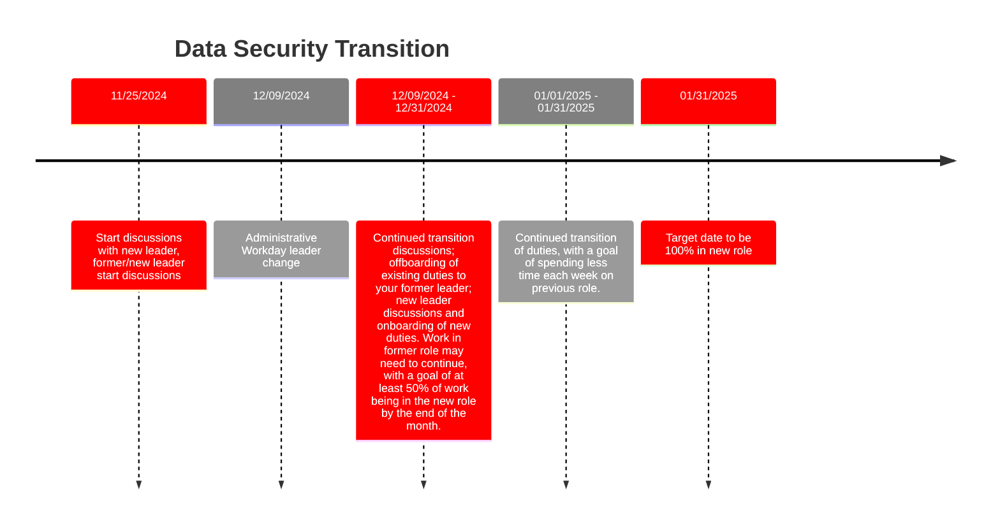

```mermaid
%%{init:
    {
        'logLevel': 'debug', 
        'theme': 'default' , 
        'themeVariables': {
            'cScale0': '#ff0000', 'cScaleLabel0': '#ffffff',
            'cScale1': '#808080', 'cScaleLabel1': '#ffffff',
            'cScale2': '#ff0000', 'cScaleLabel2': '#ffffff',
            'cScale3': '#808080', 'cScaleLabel3': '#ffffff',
            'cScale4': '#ff0000', 'cScaleLabel4': '#ffffff'
        }
    }
}%%

timeline
    title Data Security Transition
    11/25/2024:                 Start discussions with new leader, former/new leader start discussions
    12/09/2024:                 Administrative Workday leader change
    12/09/2024 - 12/31/2024:    Continued transition discussions; offboarding of existing duties to your former leader; new leader discussions and onboarding of new duties. Work in former role may need to continue, with a goal of at least 50% of work being in the new role by the end of the month. 

    01/01/2025 - 01/31/2025:    Continued transition of duties, with a goal of spending less time each week on previous role. 

    01/31/2025:                 Target date to be 100% in new role
```
