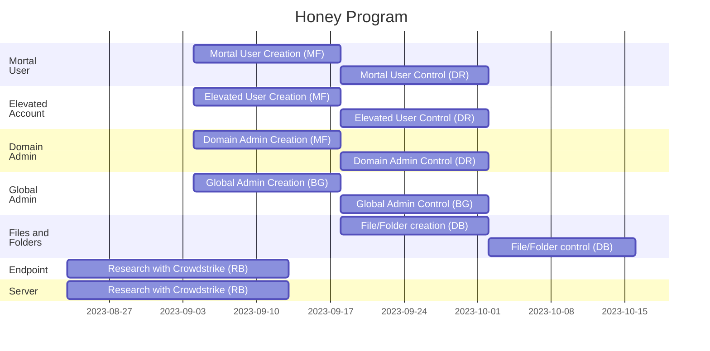

```mermaid
%%{init:
    {
        "gantt":{
            "titleTopMargin":25,
            "leftPadding":80,
            "numberSectionStyles":2,
            %%"topAxis":"true",
            "axisFormat":"%b-%Y",
            "barHeight":30,
            "barGap":15,
            "useMaxWidth": true
        }
    }
}%%

gantt
    title Honey Program
    dateFormat  YYYY-MM-DD
    todayMarker stroke-width:5px,stroke:green,opacity:0.5
    tickInterval 1week
    %% excludes 2023-09-04, Weekends
    
section Mortal<br>User
Mortal User Creation (MF)       :m1,2023-09-04,2w
Mortal User Control (DR)        :after m1,2w

section Elevated<br>Account
Elevated User Creation (MF)     :e1,2023-09-04,2w
Elevated User Control (DR)      :after e1,2w

section Domain<br>Admin
Domain Admin Creation (MF)      :d1,2023-09-04,2w
Domain Admin Control (DR)       :after d1,2w

section Global<br>Admin
Global Admin Creation (BG)      :g1,2023-09-04,2w
Global Admin Control (BG)       :after g1,2w

section Files and<br>Folders
File/Folder creation (DB)       :f1,2023-09-18,2w
File/Folder control (DB)        :after f1,2w

section Endpoint
Research with Crowdstrike (RB)  :2023-08-23, 3w

section Server
Research with Crowdstrike (RB)  :2023-08-23, 3w

```
