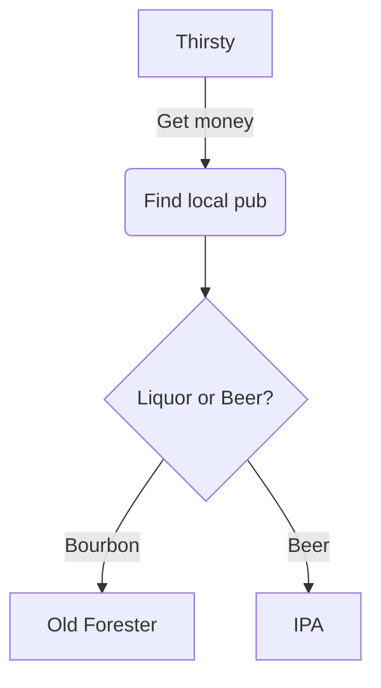
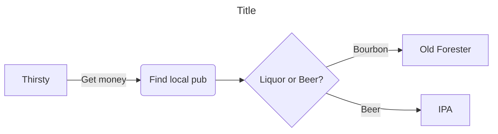
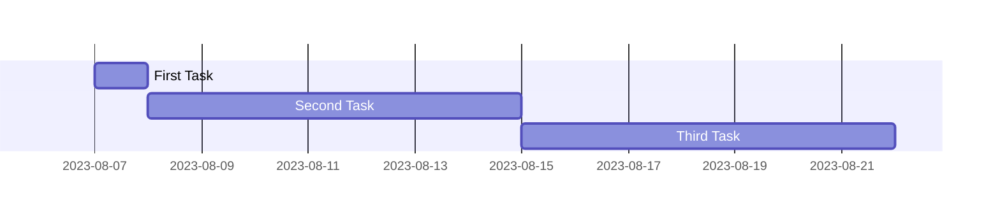
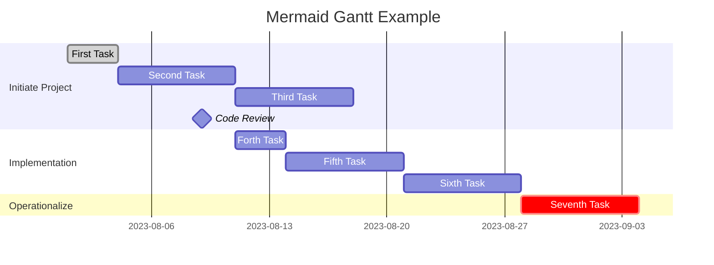
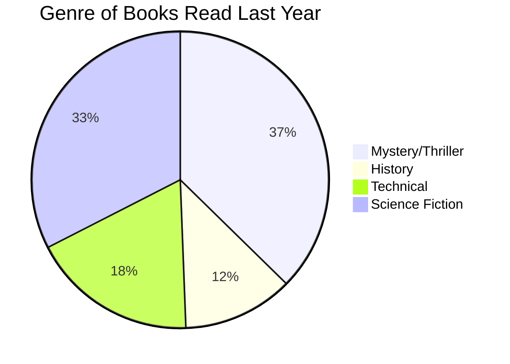
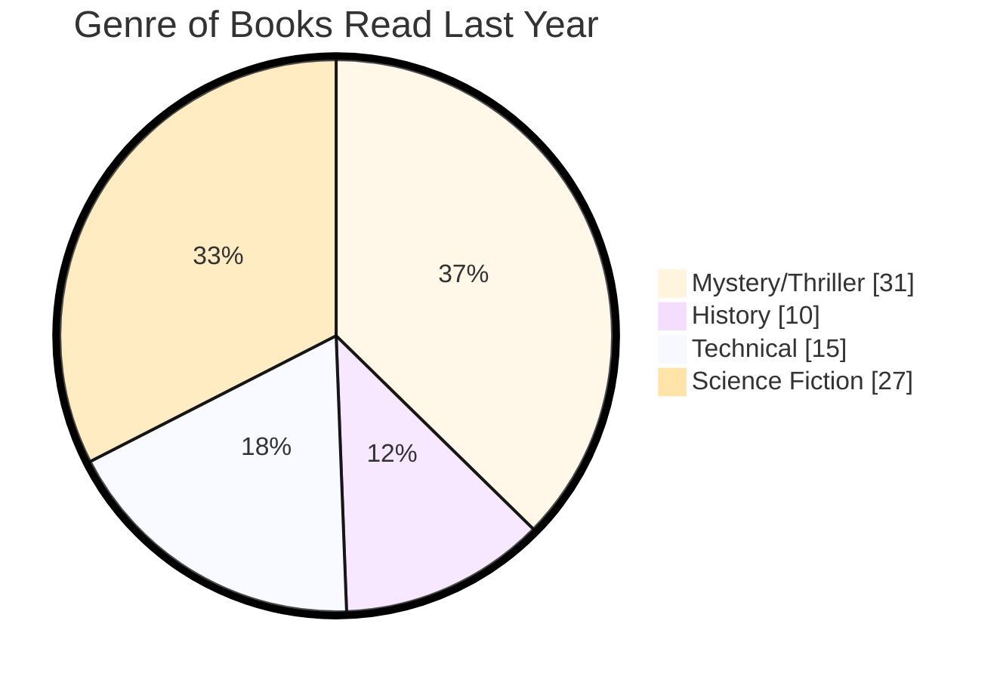

### Following are numerous examples using Mermaid to create various types of graphs in GitHub.
As I gain knowledge with Mermaid, I will add more examples.  
Use the comments if you have questions or suggestions.

## FlowCharts ##
### Simple flowchart ###
```
flowchart TD
    A[Thirsty] -->|Get money| B(Find local pub)
    B --> C{Liquor or Beer?}
    C -->|Bourbon| D[Old Forester]
    C -->|Beer| E[IPA]
```




### Formatted slightly differently (orientation and title) ###
```
--- 
title: Title
---
%% This is a comment, will be ignored
flowchart LR
    A[Thirsty] -->|Get money| B(Find local pub)
    B --> C{Liquor or Beer?}
    C -->|Bourbon| D[Old Forester]
    C -->|Beer| E[IPA]
```




## Gantt Charts
### Simple Gantt Chart ###
```
gantt
    First Task  :t1, 2023-08-07, 1d
    Second Task :t2, after t1, 1w
    Third Task  :after t2, 1w

```



### Adding a title, sections and some formatting ###
```
gantt
    title Mermaid Gantt Example
    dateFormat  YYYY-MM-DD
    tickinterval 1week
    todayMarker on
    %% excludes Weekends

    section Initiate Project
    First Task  :done, t1, 2023-08-01, 3d
    Second Task :t2, after t1, 1w
    Third Task  :after t2, 1w
    Code Review :milestone, 2023-08-09, 0d

    section Implementation
    Forth Task  :t4, after t2, 3d
    Fifth Task  :t5, after t4, 1w
    Sixth Task  :t6, after t5, 1w

    section Operationalize
    Seventh Task  :crit, after t6, 1w
```



## Pie Charts ##
### Simple Pie Chart
```
pie 
    title Genre of Books Read Last Year
    "Mystery/Thriller"  :31
    "History"           :10
    "Technical"         :15
    "Science Fiction    :27
```



### Pie Chart with added features 
(theme can be: default, base, forest, dark, and neutral)
```
%%{init:
    {
        "theme":"base", 
        "pie": {"textPosition": 0.5 }, 
        "themeVariables": {"pieOuterStrokeWidth":"5px"}
    }
}%%
pie showData
    title Genre of Books Read Last Year
    "Mystery/Thriller"  :31
    "History"           :10
    "Technical"         :15
    "Science Fiction"   :27
```


## Quadrant Charts ##
### Simple Quadrant Chart
