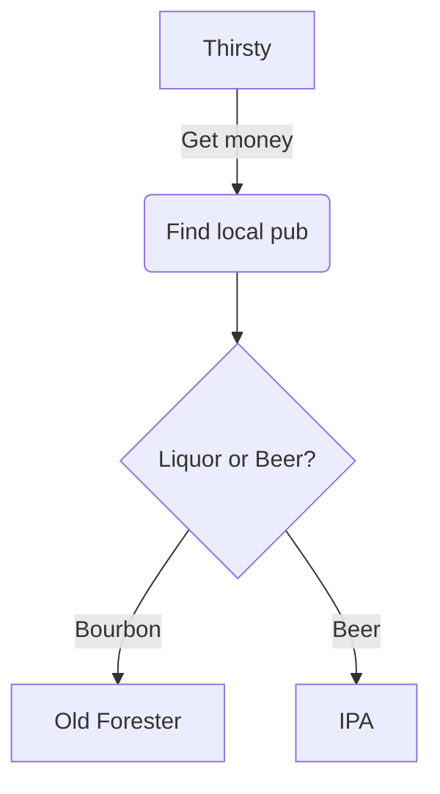
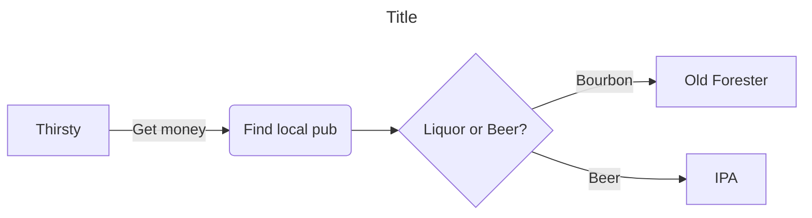

### Following are numerous examples using Mermaid to create various types of graphs in GitHub.
As I gain knowledge with Mermaid, I will add more examples.  
Use the comments if you have questions.
```
flowchart TD
    A[Thirsty] -->|Get money| B(Find local pub)
    B --> C{Liquor or Beer?}
    C -->|Bourbon| D[Old Forester]
    C -->|Beer| E[IPA]
```
*Simple Flowchart*



### Formatted slightly differently (orientation and title) ###
```
--- 
title: Title
---
%% This is a comment, will be ignored
flowchart LR
    A[Thirsty] -->|Get money| B(Find local pub)
    B --> C{Liquor or Beer?}
    C -->|Bourbon| D[Old Forester]
    C -->|Beer| E[IPA]
```


