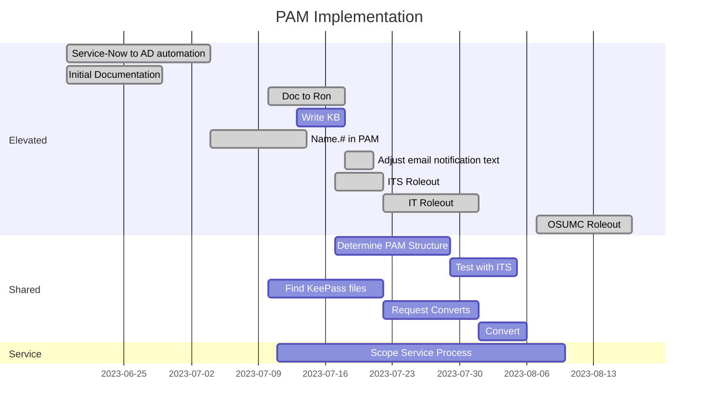

```mermaid

gantt
    title PAM Implementation
    dateFormat  YYYY-MM-DD
    tickinterval 1week
    todayMarker on

    section Elevated
    Service-Now to AD automation    :done, a1, 2023-06-19, 15d
    Initial Documentation           :done, 2023-06-19,10d
    Doc to Ron                      :done, 2023-07-10, 8d
    Write KB                        :2023-07-13, 5d
    Name.#35; in PAM                :done, after a1, 10d
    Adjust email notification text  :done, 2023-07-18,3d
    ITS Roleout                     :done, a3, 2023-07-17, 5d
    IT Roleout                      :done,a4, after a3, 10d
    OSUMC Roleout                   :done, 2023-08-07, 10d

    section Shared
    Determine PAM Structure         :s1, 2023-07-17, 12d
    Test with ITS                   :after s1,7d
    Find KeePass files              :s2, 2023-07-10, 12d
    Request Converts                :s3, after s2, 10d
    Convert                         :after s3, 5d

    section Service
    Scope Service Process           :2023-07-11, 30d
```