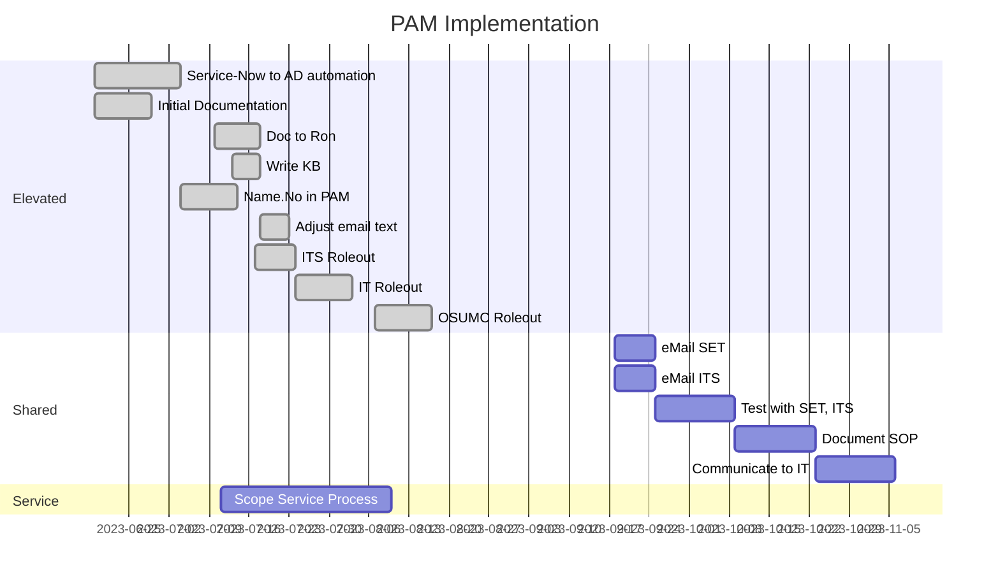

```mermaid

gantt
    title PAM Implementation
    dateFormat  YYYY-MM-DD
    tickinterval 1week
    todayMarker on

    section Elevated
    Service-Now to AD automation    :done, a1, 2023-06-19, 15d
    Initial Documentation           :done, 2023-06-19,10d
    Doc to Ron                      :done, 2023-07-10, 8d
    Write KB                        :done, 2023-07-13, 5d
    Name.No in PAM                :done, a2, after a1, 10d
    Adjust email text               :done, 2023-07-18,5d
    ITS Roleout                     :done, a3, 2023-07-17, 1w
    IT Roleout                      :done, a4, after a3, 10d
    OSUMC Roleout                   :done, 2023-08-07, 10d

    section Shared
    eMail SET                       :s1, 2023-09-18, 1w
    eMail ITS                       :s2, 2023-09-18, 1w
    Test with SET, ITS              :s3, after s1 s2, 2w
    Document SOP                    :s4, after s3, 2w
    Communicate to IT               :s5, after s4, 2w
    

    section Service
    Scope Service Process           :2023-07-11, 30d
```
