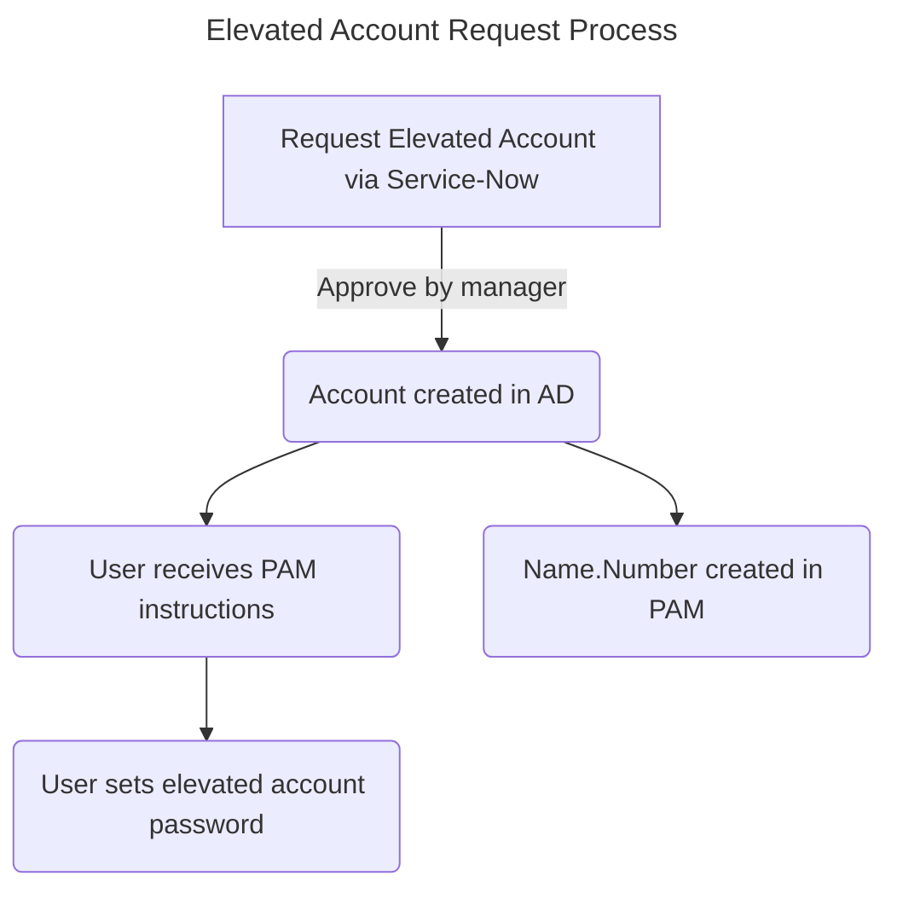

```mermaid
---
title: Elevated Account Request Process
---
    flowchart TD
    A[Request Elevated Account via Service-Now] -->|Approve by manager|B(Account created in AD);
    B -->C(User receives PAM instructions) & D(Name.Number created in PAM);
    C -->E(User sets elevated account password);
```