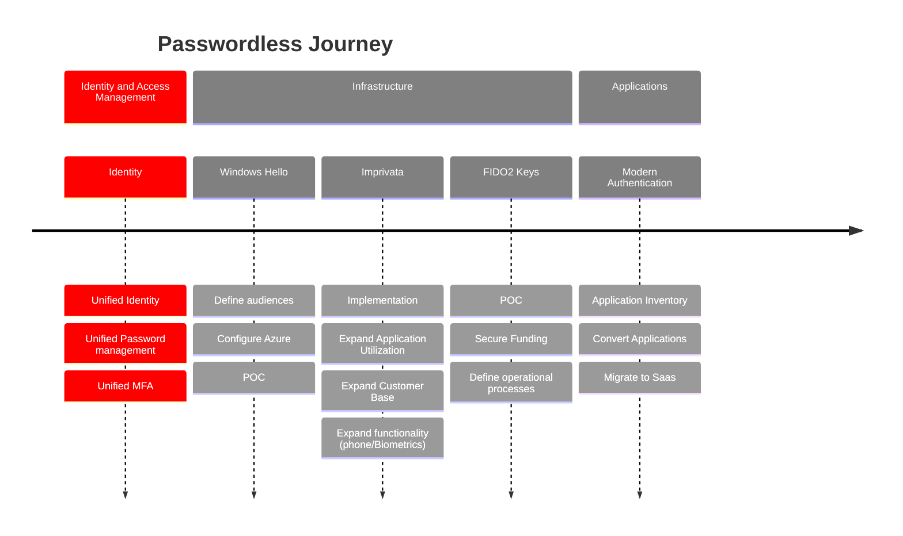

```mermaid
%%{init:
    {
        'logLevel': 'debug', 
        'theme': 'default' , 
        'themeVariables': {
            'cScale0': '#ff0000', 'cScaleLabel0': '#ffffff',
            'cScale1': '#808080', 'cScaleLabel1': '#ffffff',
            'cScale2': '#808080', 'cScaleLabel2': '#ffffff'
        }
    }
}%%

timeline
    title Passwordless Journey
    Section Identity and Access Management
        Identity: Unified Identity: Unified Password management: Unified MFA
    Section Infrastructure
        Windows Hello: Define audiences: Configure Azure: POC
        Imprivata: Implementation: Expand Application Utilization: Expand Customer Base: Expand functionality (phone/Biometrics)
        FIDO2 Keys: POC: Secure Funding: Define operational processes
    Section Applications
        Modern Authentication: Application Inventory: Convert Applications : Migrate to Saas


```
