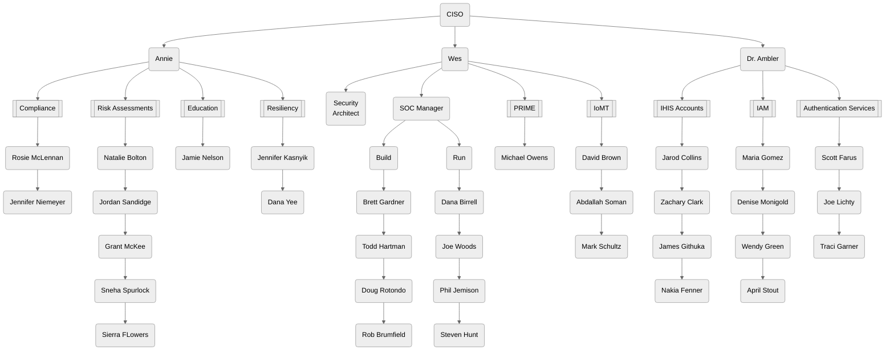

```mermaid
---
config:
  theme: neutral
  layout: dagre
---
flowchart TB
    CISO("CISO") --> Risk("Annie") & AD("Wes") & Identity("Dr. Ambler")

    Risk --> RA[["Risk Assessments"]] & ED[[Education]] & COMP[["Compliance"]] & RES[["Resiliency"]]
    COMP --> Rosie(Rosie McLennan) --> JennN(Jennifer Niemeyer)
    RA --> Natalie(Natalie Bolton) --> JS(Jordan Sandidge) --> Grant(Grant McKee) --> Sneha(Sneha Spurlock) --> Sierra(Sierra FLowers)
    ED --> Jamie(Jamie Nelson)
    RES --> JennK(Jennifer Kasnyik) --> DanaY(Dana Yee)
    AD --> AR("Security<BR>Architect") & SOC("SOC Manager") & IoMT[[IoMT]] & Prime[[PRIME]]
    SOC --> BSOC("Build") & RSOC("Run")
    BSOC --> Brett(Brett Gardner) --> Todd(Todd Hartman) --> Doug(Doug Rotondo) --> Rob(Rob Brumfield)
    RSOC --> DanaB(Dana Birrell) --> JoeW(Joe Woods) --> Phil(Phil Jemison) --> Steve(Steven Hunt)
    Prime --> Mowens(Michael Owens)
    IoMT --> DavidB(David Brown) --> Abdallah(Abdallah Soman) --> Marks(Mark Schultz)
    Identity --> IHIS[["IHIS Accounts"]] & IA[["IAM"]] & AS[["Authentication Services"]]
    IHIS --> Jarod(Jarod Collins) --> Zach(Zachary Clark) --> James(James Githuka) --> Nakia(Nakia Fenner)
    IA --> Maria(Maria Gomez) --> Denise(Denise Monigold) --> Wendy(Wendy Green) --> April(April Stout)
    AS --> Scott(Scott Farus) --> JoeL(Joe Lichty) --> Traci(Traci Garner)

```