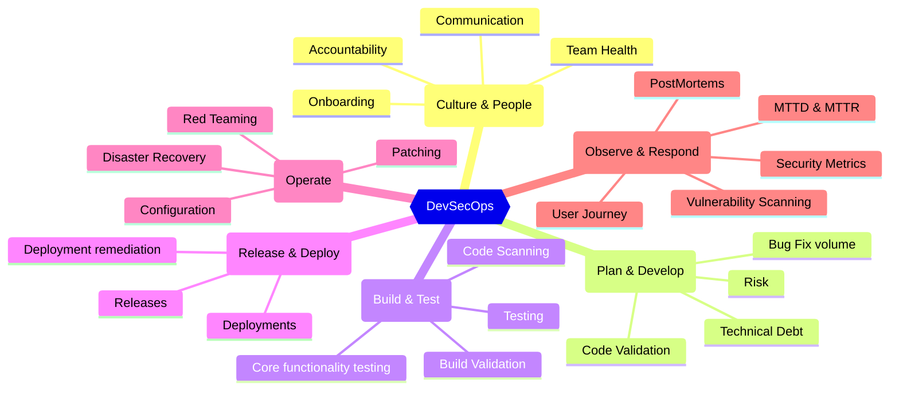

```mermaid

mindmap
    root{{DevSecOps}}
        (Culture & People)
            Communication
            Onboarding
            Accountability
            Team Health
        (Plan & Develop)
            Risk
            Technical Debt
            Bug Fix volume
            Code Validation
        (Build & Test)
            Testing
            Code Scanning
            Build Validation
            Core functionality testing
        (Release & Deploy)
            Deployments
            Releases
            Deployment remediation
        (Operate)
            Configuration
            Patching
            Red Teaming
            Disaster Recovery
        (Observe & Respond)
            Vulnerability Scanning
            Security Metrics
            User Journey
            MTTD & MTTR
            PostMortems
                        
            

```
