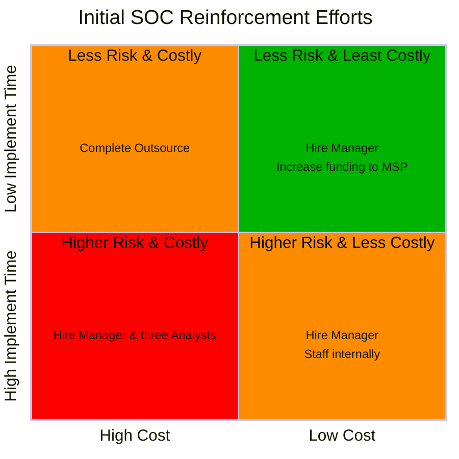

```mermaid
%%{init:{
    "quadrantChart": {
        "chartWidth": 450, 
        "chartHeight": 450,
        "pointRadius": 0
    },"themeVariables":{
        "quadrant4Fill":"#FF8C00",
        "quadrant2Fill":"#FF8C00",
        "quadrant1Fill":"#00b300",
        "quadrant3Fill": "#FF0000"}
    }
}%%
quadrantChart
    title Initial SOC Reinforcement Efforts
    x-axis High Cost --> Low Cost
    y-axis High Implement Time --> "Low Implement Time"
    quadrant-1 Less Risk & Least Costly
    quadrant-2 Less Risk & Costly
    quadrant-3 Higher Risk & Costly
    quadrant-4 Higher Risk & Less Costly
    Hire Manager & three Analysts: [0.25, 0.25]
    Hire Manager: [0.75, 0.75]
    Increase funding to MSP: [0.75, 0.70]
    Hire Manager: [0.75, 0.25]
    Staff internally: [0.75, 0.20]
    Complete Outsource: [0.25, 0.75]
```