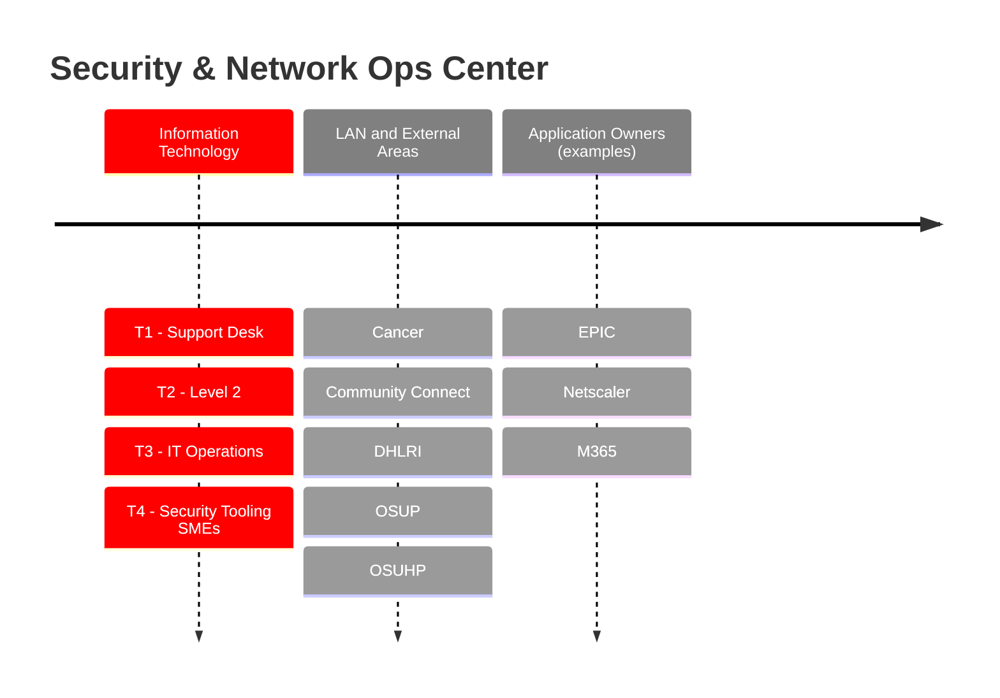

```mermaid
%%{init:
    {
        'logLevel': 'debug', 
        'theme': 'default' , 
        'themeVariables': {
            'cScale0': '#ff0000', 'cScaleLabel0': '#ffffff',
            'cScale1': '#808080', 'cScaleLabel1': '#ffffff',
            'cScale2': '#808080', 'cScaleLabel2': '#ffffff'
        }
    }
}%%

timeline
    title Security & Network Ops Center
    Information Technology 
      : T1 - Support Desk
      : T2 - Level 2 
      : T3 - IT Operations 
      : T4 - Security Tooling SMEs
    LAN and External Areas
      : Cancer
      : Community Connect 
      : DHLRI 
      : OSUP 
      : OSUHP
    Application Owners (examples) 
      : EPIC
      : Netscaler
      : M365


```
