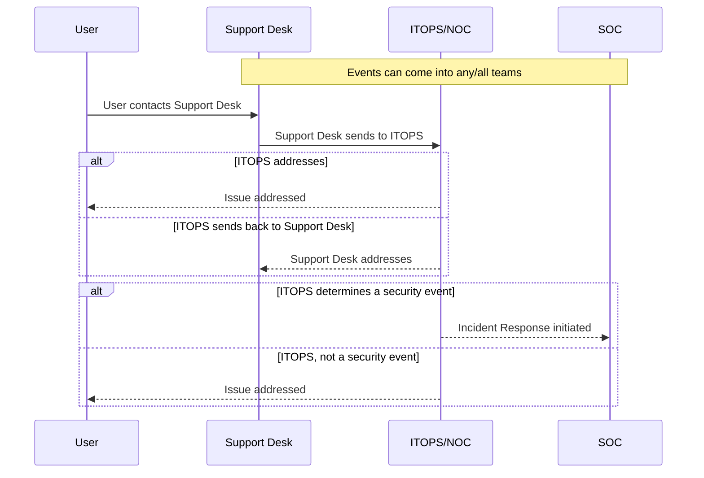

```mermaid
sequenceDiagram
    participant User as User
    participant SD as Support Desk
    participant T23 as ITOPS/NOC
    participant SOC as SOC

    Note over SD,SOC: Events can come into any/all teams
    User->>SD: User contacts Support Desk
    SD->>T23: Support Desk sends to ITOPS
   
    alt ITOPS addresses
        T23-->>User: Issue addressed
    else ITOPS sends back to Support Desk
        T23-->>SD: Support Desk addresses
    end

    alt ITOPS determines a security event
        T23-->>SOC: Incident Response initiated
    else ITOPS, not a security event
        T23-->>User: Issue addressed
    end
```
