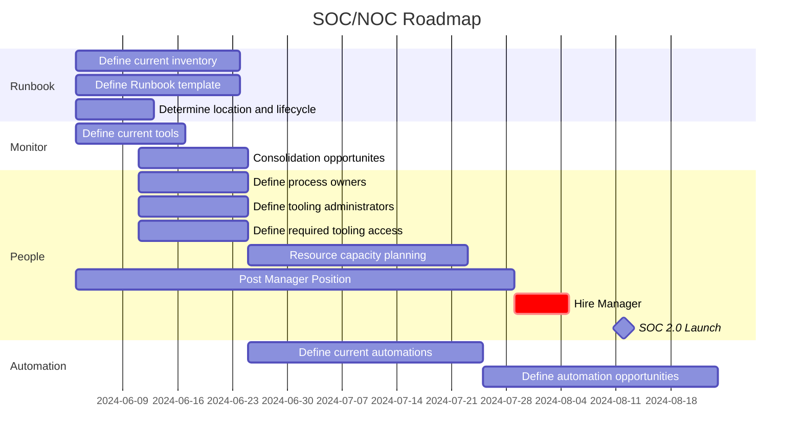

```mermaid

gantt
    title SOC/NOC Roadmap
    dateFormat  YY-MM-DD
    tickinterval 1week
    todayMarker on

    
    section Runbook
    Define current inventory        :r1, 2024-06-03, 3w
    Define Runbook template         :r2, 2024-06-03, 3w      
    Determine location and lifecycle:r3, 2024-06-03, 10d
    

    section Monitor
    Define current tools            :m1, 2024-06-03, 2w
    Consolidation opportunites      :m2, 2024-06-11, 2w

    
    section People
    Define process owners           :p1, 2024-06-11, 2w
    Define tooling administrators   :p2, 2024-06-11, 2w
    Define required tooling access  :p3, 2024-06-11, 2w
    Resource capacity planning      :p4, 2024-06-25, 4w
    Post Manager Position           :p5, 2024-06-03, 8w
    Hire Manager                    :crit, p6, after p5, 1w
    SOC 2.0 Launch                  :milestone, after p6, 2w


    section Automation
    Define current automations      :a1, 2024-06-25, 30d
    Define automation opportunities :a2, 2024-07-25, 30d


     
```
