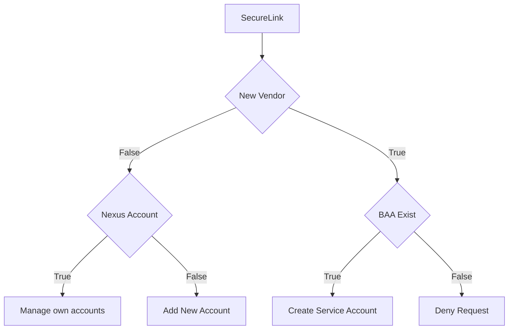

```mermaid
flowchart TD
    A[SecureLink] --> B{New Vendor}
    B --> |False| F{Nexus Account}
    F --> |True| G[Manage own accounts]
    F --> |False| H[Add New Account]
    B --> |True| C{BAA Exist}
    C --> |True| D[Create Service Account]
    C --> |False| E[Deny Request]
```