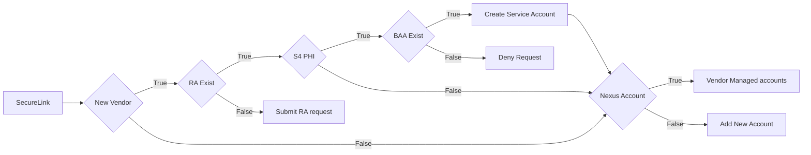

```mermaid
flowchart LR
    A[SecureLink] --> B{New Vendor}
    B --> |True| R{RA Exist}
    R --> |True| S4{S4 PHI}
    R --> |False| Q[Submit RA request]
    S4 --> |True| C{BAA Exist} 
    S4 --> |False| F
    B --> |False| F{Nexus Account}
    F --> |True| G[Vendor Managed accounts]
    F --> |False| H[Add New Account]
    C --> |True| D[Create Service Account]
    D --> F 
    C --> |False| I[Deny Request]
```
