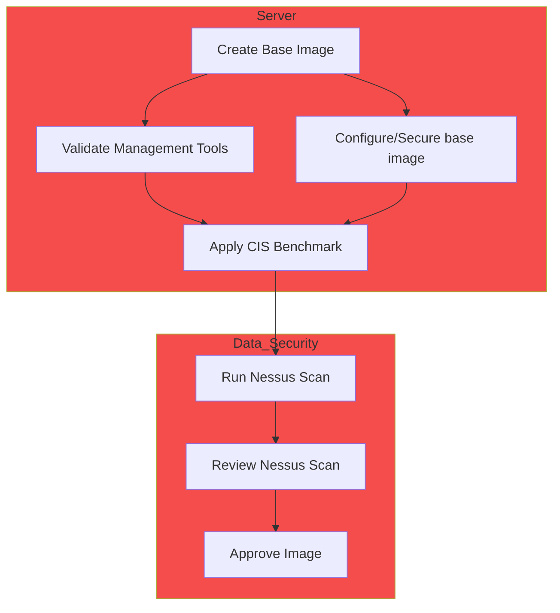

```mermaid
flowchart TD

    subgraph Server
        A1[Create Base Image]   --> A2[Configure/Secure base image]
        A1                      --> A4[Validate Management Tools]
        A4                      --> A3
        A2                      --> A3[Apply CIS Benchmark]
    end

    subgraph Data_Security
        A3                      --> B1[Run Nessus Scan]
        B1                      --> B2[Review Nessus Scan]
        B2                      --> B4[Approve Image]
    end

    classDef dark fill:#F54C4C
    class Server,Data_Security dark
```