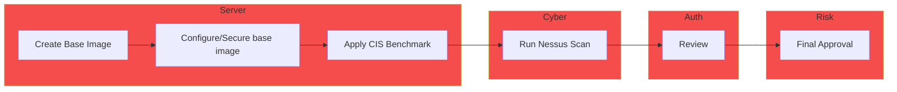

```mermaid
flowchart LR

    subgraph Server
    A1[Create Base Image]-->A2[Configure/Secure base image]
    A2-->A3[Apply CIS Benchmark]
    end

    subgraph Cyber
    A3-->B1[Run Nessus Scan]
    end

    subgraph Auth
    B1-->C1[Review]
    end

    subgraph Risk
    C1-->D1[Final Approval]
    end

    classDef dark fill:#F54C4C
    class Server,Cyber,Auth,Risk dark
```