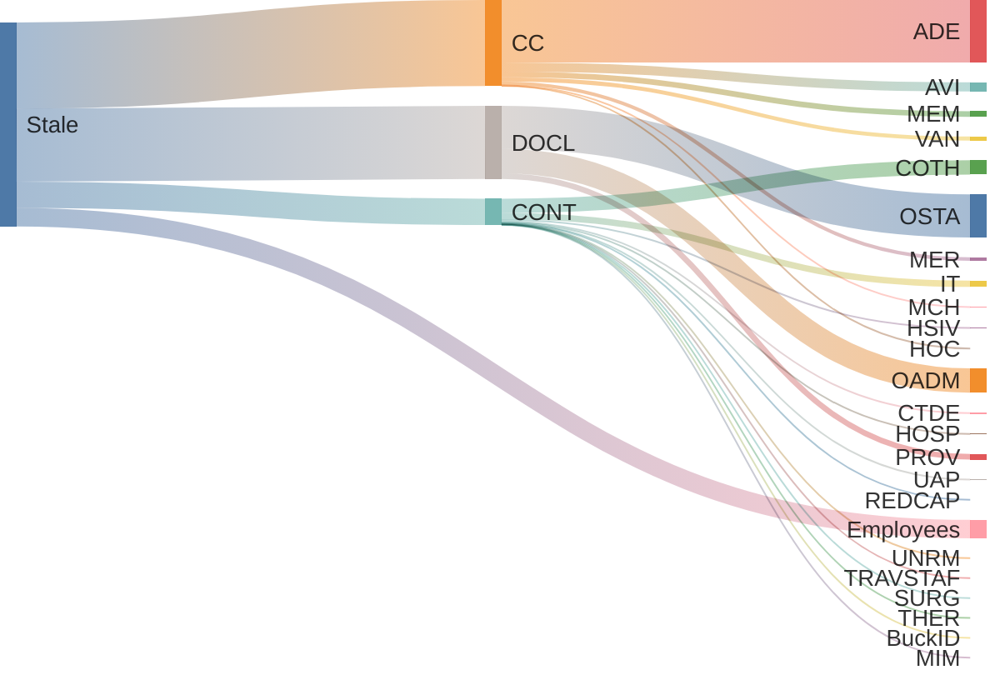

```mermaid
---
config:
  sankey:
    showValues: false
---
sankey-beta
Stale, CC,688
CC,ADE,500
CC,AVI,73
CC,MEM,45
CC,VAN,32
CC,MER,29
CC,MCH,6
CC,HOC,3

Stale,DOCL,584
DOCL,OSTA,345
DOCL,OADM,194
DOCL,PROV,45

Stale,CONT,210
CONT,COTH,114
CONT,IT,51
CONT,HSIV,11
CONT,CTDE,11
CONT,HOSP,6
CONT,UAP,4
CONT,REDCAP,4
CONT,UNRM,2
CONT,TRAVSTAF,2
CONT,SURG,2
CONT,THER,1
CONT,BuckID,1
CONT,MIM,1

Stale, Employees,147
```

