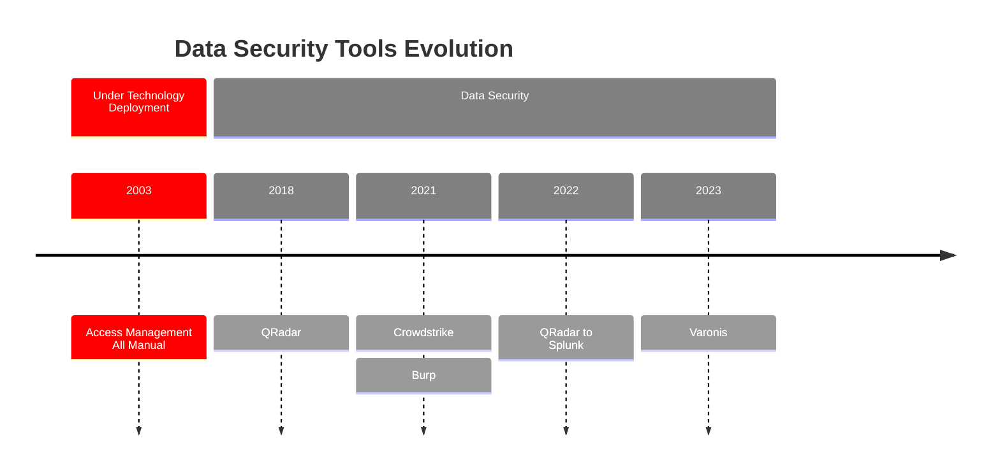

```mermaid
%%{init:
    {
        'logLevel': 'debug', 
        'theme': 'default' , 
        'themeVariables': {
            'cScale0': '#ff0000', 'cScaleLabel0': '#ffffff',
            'cScale1': '#808080', 'cScaleLabel1': '#ffffff',
            'cScale2': '#808080', 'cScaleLabel2': '#ffffff'
        }
    }
}%%

timeline
    title Data Security Tools Evolution
    section Under Technology Deployment
    2003: Access Management <br> All Manual

    section Data Security
    2018: QRadar
    2021: Crowdstrike : Burp
    2022: QRadar to <br>Splunk
    2023: Varonis
```
