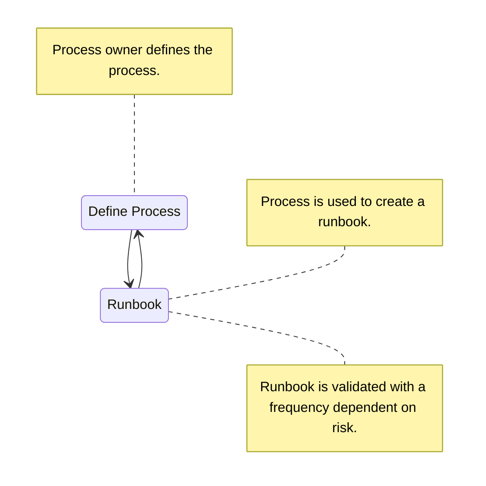

```mermaid
stateDiagram
    
Process: Define Process
    note left of Process
        Process owner defines the process.
    end note
Process --> Runbook
    note left of Runbook
        Process is used to create a runbook.
    end note
Runbook --> Process
    note right of Runbook
        Runbook is validated with a frequency dependent on risk.
    end note

```

