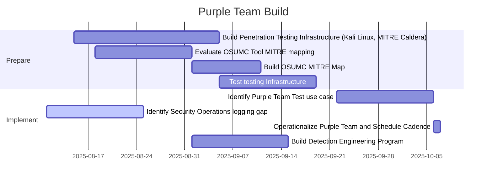

```mermaid
gantt
    title Purple Team Build
    dateFormat  YYYY-MM-DD
    
    section Prepare
    Build Penetration Testing Infrastructure (Kali Linux, MITRE Caldera) :a1, 2025-08-15, 3w
    Evaluate OSUMC Tool MITRE mapping                                    :a2, 2025-08-18, 14d
    Build OSUMC MITRE Map                                                :a3, after a2, 10d
    Test testing Infrastructure                                          :a4, after a1, 2w
    
    section Implement
    Identify Purple Team Test use case                                   :a5, 2025-09-22, 2w
    Identify Security Operations logging gap                             :active, a6, 2025-08-11, 14d
    Operationalize Purple Team and Schedule Cadence                      :a7, after a5,  1d
    Build Detection Engineering Program                                  :a8, 2025-09-01, 14d
    

```
